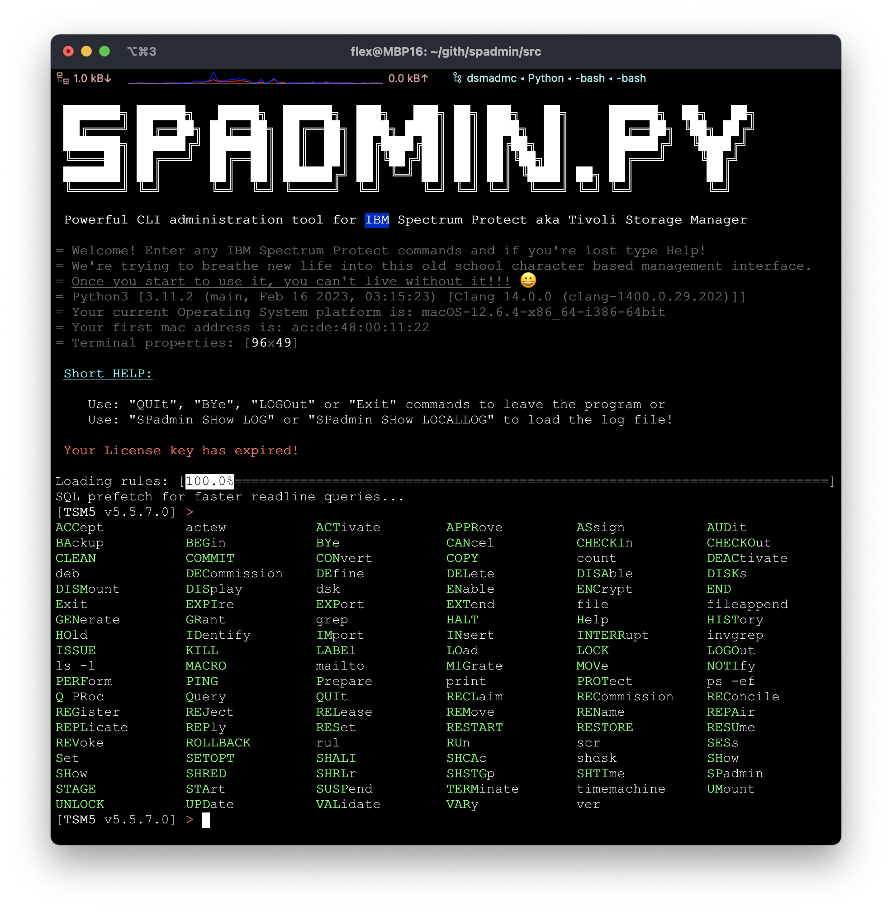

# spadmin.py project

Global spadmin.py development progress status: 

## Collaborators

<table>
<tr>
    <td align="center">
        <a href="https://github.com/FleXoft">
            
             
            <b>_flex</b>,  Fleischmann György
        </a>
    </td>
    <td align="center">
        <a href="https://github.com/marcellszabo-spedinfo">
            
             
            <b>szmarcell</b>,  Szabó Marcell
        </a>
    </td>
    <td align="center">
        <a href="https://github.com/gpolik">
            
             
            <b>gpolik</b>,  Polik György
        </a>
    </td>
    <td align="center">
        <a href="https://github.com/Doffy1">
            
             
            <b>doffy</b>,  Dósa István
        </a>
    </td>
 </tr>
 </table>
 
## Contributors
