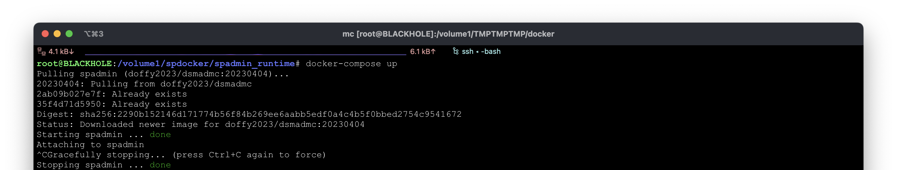

# Installation steps
## 1. Install Docker
Install the Docker Engine as described here: https://docs.docker.com/engine/install/
or here: https://www.upwork.com/resources/install-docker-engine

## 2. Start container with Docker Composer
Clone `spadmin_runtime` folder to local disk and `cd spadmin_runtime`

#### 2.1 Change TSM - SP server connection data's by local environment
Change connection information in `dsm.sys` file.

#### 2.2 Set SSH login authorized keys
Add public key of authorized user's in `authorized_keys` file to enable ssh connection to container.

#### 2.3 SPadmin setup
Copy SPadmin binary file to `spadmin_runtime` folder as `spadmin_latest` file and `chmod +x spadmin_latest`.

#### 2.4 Start container
`docker compose up`

#### 2.5 (Stop container)

(Use `ctrl + c` to stop container.)

#### 2.6 Test container connection from a different terminal session
`ssh -p 2222 root@<docker server DNS name or IP>`

## 3. Start container as daemon

If container connection tested, then with next command you can start it as a daemon:

`docker compose up -d`

If the `systemctl status docker.service` is running and enabled, then after reboot it will restart the daemonized containers.

## Commands reference
`docker help` or https://docs.docker.com/reference/

## Examples

### Linux

### macOS

### Microsoft Windows

### Synology NAS (DS 916+)

```
root@BLACKHOLE:/volume1/spdocker/spadmin_runtime# docker-compose up
Pulling spadmin (doffy2023/dsmadmc:20230404)...
20230404: Pulling from doffy2023/dsmadmc
2ab09b027e7f: Already exists
35f4d71d5950: Already exists
Digest: sha256:2290b152146d171774b56f84b269ee6aabb5edf0a4c4b5f0bbed2754c9541672
Status: Downloaded newer image for doffy2023/dsmadmc:20230404
Starting spadmin ... done
Attaching to spadmin
^CGracefully stopping... (press Ctrl+C again to force)
Stopping spadmin ... done
root@BLACKHOLE:/volume1/spdocker/spadmin_runtime#
```


```
$ ssh -p 2222 root@localhost
root@spadmin:~# spadmin

 ███████╗ ██████╗   █████╗  ██████╗  ███╗   ███╗ ██╗ ███╗   ██╗     ██████╗  ██╗   ██╗
 ██╔════╝ ██╔══██╗ ██╔══██╗ ██╔══██╗ ████╗ ████║ ██║ ████╗  ██║     ██╔══██╗ ╚██╗ ██╔╝
 ███████╗ ██████╔╝ ███████║ ██║  ██║ ██╔████╔██║ ██║ ██╔██╗ ██║     ██████╔╝  ╚████╔╝
 ╚════██║ ██╔═══╝  ██╔══██║ ██║  ██║ ██║╚██╔╝██║ ██║ ██║╚██╗██║     ██╔═══╝    ╚██╔╝
 ███████║ ██║      ██║  ██║ ██████╔╝ ██║ ╚═╝ ██║ ██║ ██║ ╚████║ ██╗ ██║         ██║
 ╚══════╝ ╚═╝      ╚═╝  ╚═╝ ╚═════╝  ╚═╝     ╚═╝ ╚═╝ ╚═╝  ╚═══╝ ╚═╝ ╚═╝         ╚═╝

 Powerful CLI administration tool for IBM Spectrum Protect aka Tivoli Storage Manager

= Welcome! Enter any IBM Spectrum Protect commands and if you're lost type Help!
= We're trying to breathe new life into this old school character based management interface.
= Once you start to use it, you can't live without it!!! 😀
= Python3 [3.9.16 (main, Dec  8 2022, 11:00:20)
[GCC 9.4.0]]
= Your current Operating System platform is: Linux-3.10.108-x86_64-with-glibc2.35
= Your first mac address is: 02:42:ac:12:00:02
= Terminal properties: [154x40]

 Short HELP:

    Use: "QUIt", "BYe", "LOGOut" or "Exit" commands to leave the program or
    Use: "SPadmin SHow LOG" or "SPadmin SHow LOCALLOG" to load the log file!

 Your License key has expired!

Loading rules: [100.0%===================================================================================================================================]
SQL prefetch for faster readline queries...
[TSM5] > q sess
 Sess      Comm.      Sess        Wait       Bytes       Bytes      Sess      Platform     Client Name
Number     Method     State        Time        Sent       Recvd     Type
------     ------     ------     ------     -------     -------     -----     --------     --------------------
 3,499     Tcp/Ip     IdleW       13 S          515         421     Admin     Linux        SUPPORT
                                                                               x86-64
 3,500     Tcp/Ip     Run          0 S          131         176     Admin     Linux        SUPPORT
                                                                               x86-64
[TSM5] > sh sess
- ---- ----- ---- ----- -------- ----- ------------ ------- -------- --------------
#  Id  State Wait  Sent Received  Type   Platform   Name    MediaAcc Verb
- ---- ----- ---- ----- -------- ----- ------------ ------- -------- --------------
1 3499  Run   0 s 519 B    717 B Admin Linux x86-64 SUPPORT          RecvAdmCmd
2 3500 IdleW  2 s 537 B    176 B Admin Linux x86-64 SUPPORT          SentAdmCmdResp
[TSM5] > quit
----------------------------------------------------------------------------------------------------------------------------------------------------------
Program execution time: 0:00:19.038604
----------------------------------------------------------------------------------------------------------------------------------------------------------
Background dsmadmc processes cleaning...
root@spadmin:~#
```
